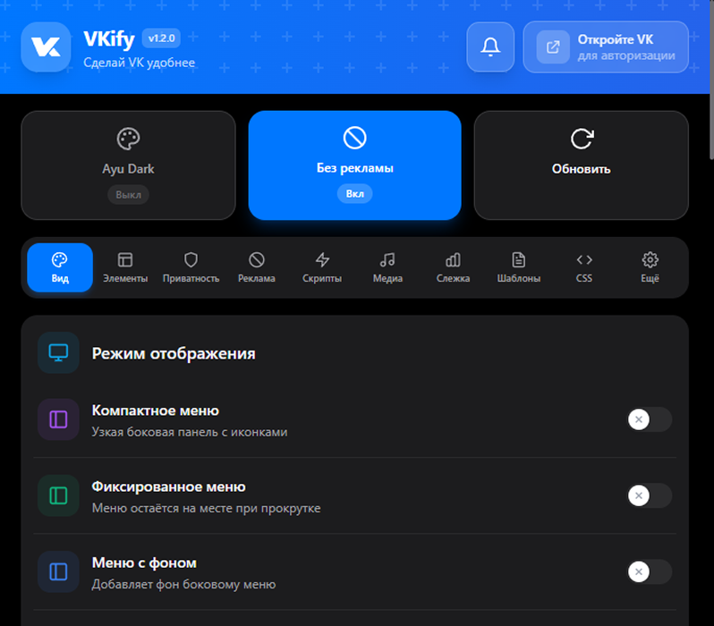

<div align="center">
  

  # VKify

  **Расширение для Chrome, Firefox и Opera, которое делает ВКонтакте удобнее, красивее и приватнее**

  [](https://vkify.ru)
  [](https://t.me/VKify)
  [](https://vk.com/vkify)
  [](https://github.com/VKify/vkify-extension)

  [](https://chromewebstore.google.com/detail/vkify/lofggenkgbpdmmplnbgfplnpfjhgljla)
  [](https://addons.mozilla.org/ru/firefox/addon/vkify/)

  
  
  
  
  
  
  
  
  

  [English version →](README.en.md)

  <br/>

  
</div>

---

## Возможности

VKify собирает в одном расширении всё, чего обычно не хватает во ВКонтакте: оформление под себя, чистую ленту без рекламы, приватность переписки, скачивание медиа и инструменты для сообщений. Настройки открываются в попапе (10 вкладок) или прямо на странице — `vk.com/vkify_settings`. По `Ctrl/Cmd + K` работает поиск по всем функциям.

Всё применяется **мгновенно и без перезагрузки**: изменения видны на странице ещё в момент перетаскивания ползунка, синхронизируются между всеми открытыми вкладками, а при следующей загрузке страницы оформление подхватывается ещё до первой отрисовки — без «вспышки» ванильного VK.

### Оформление

- 72 встроенные темы в 11 категориях (Classic, Soft, AMOLED, Colored, Neon, Nature, Minimal, Retro, Warm, Cool) и автоматическое переключение свет/тьма
- Свой акцентный цвет для всей палитры интерфейса — с живым предпросмотром или автоподбором из выбранного фона
- Более 60 шрифтов через Google Fonts с настройкой размера, межстрочного интервала, насыщенности и стиля
- Обои страницы: картинки (файлом или по ссылке), видео и HTML-анимации, с размытием, затемнением и прозрачностью
- Визуальные фильтры для изображений: чёрно-белый, сепия, инверсия, контраст, размытие, затемнение
- Настраиваемый радиус скругления и форма аватарок (капля, лист, лепесток, клякса)
- **Профили оформления** — сохраняйте наборы «тема + шрифт + фон + фильтры» и переключайтесь в один клик
- **Встроенные пресеты** — «Минимализм», «Приватность» и «Производительность»: готовые наборы настроек с включением и выключением одной кнопкой
- **Умные предупреждения** — при включении конфликтующих функций (например, инверсии цветов поверх темы) расширение предложит выбрать одну из них

### Макет и навигация

- Широкий режим с адаптивным двухколоночным профилем
- Настраиваемая ширина контента
- Компактный режим — убирает лишние отступы между блоками (классический VK и VKUI)
- Смещение страницы до ±600 px для широких мониторов
- Минималистичное левое меню с подсказками и фиксацией при прокрутке
- Скрытие отдельных пунктов и счётчиков левого меню ВКонтакте
- Перестановка панелей мессенджера: список бесед справа, открытый диалог слева
- Перестановка колонок местами на страницах профиля и сообществ
- Сворачивающийся поиск, кнопка «Наверх», скелетон-режим при загрузке

### Чистая лента и блокировка рекламы

- Блокировка левого рекламного блока
- Блокировка рекламы в ленте на уровне API и отдельно через DOM-фильтр со своим списком ключевых слов
- Блокировка трекеров и аналитики: Яндекс.Метрика, Google Analytics, Facebook Pixel и другие
- Журнал блокировок с фильтрами, пагинацией и JSON-снимком для API-блокировок

### Скрытие элементов интерфейса

- Истории в ленте и истории возможных друзей на профиле
- Правая колонка в ленте и на странице профиля
- Блок написания поста и комментарии под постами
- Рекомендации, карусель «возможные друзья», эмодзи-статус у имени
- Промо-блок на профиле и реклама в музыке
- Мини-чат, кнопка «Наверх»
- Пункты меню, счётчики, «Настройки» в меню
- Недавние сообщества и рекомендуемые каналы в мессенджере

### Приватность

- Шифрование сообщений двумя протоколами: COFFEE (совместим с Kate Mobile, Laney, Vika) и VKify E2E v2 на AES-256-GCM с PBKDF2; входящие расшифровываются автоматически
- Режим невидимки: вас не видно в сети, и при этом вы не видите чужой онлайн
- Не показывать собеседнику «печатает» и не отмечать сообщения прочитанными
- Скрытие переписок по горячей клавише и список спрятанных чатов
- Размытие страницы при потере фокуса окна

### Центр

Хаб с инструментами для переписки, ленты и медиа — устроен как разделы VK, с левым рейлом и подстраницами.

- **Сообщения** — быстрое копирование последнего сообщения, экспорт диалога в JSON, TXT, HTML или ZIP с вложениями, шаблоны и заметки
- **Шаблоны** — редактор с переменными (`%first_name%`, `%title%`, `%date%` и др.), вызов по «/» или горячей клавише, режим «отправить сразу»
- **Заметки** — привязка к диалогам, поиск по содержимому, закрепление, группировка по дням с аватарами авторов
- **Лента** — раскрытие текста длинных постов, скачивание историй
- **Видео** — скачивание с выбором качества от 1080p до 240p: страницы vkvideo.ru и модальный плеер vk.com (ссылки вида `?z=video-…`)
- **Клипы** — скачивание VK Clips с выбором качества
- **Фото** — скачивание отдельных фото и целых альбомов в ZIP (до 1000 за запрос)
- **Музыка** — скачивание треков и альбомов в MP3 с выбором битрейта (128/192/320), ID3-тегами и обложкой, подбором текста песни и форматом имени файла; пакетная загрузка со страницы аудио и мульти-загрузка своих файлов
- **Плеер** — горячие клавиши аудиоплеера (play/pause, перемотка, скорость), локальные и глобальные через `chrome.commands`, автозапуск музыки после перезагрузки страницы; 10-полосный эквалайзер (Web Audio API) с преампом, готовыми и своими пресетами и плавающей панелью со сворачиванием
- Центр загрузок на странице: прогресс, отмена в один клик с сохранением уже скачанного, фоновая работа

### Слежка

- Активность в сообщениях через перехват LongPoll: печать, голосовые, медиа, прочтение, редактирование, удаление (с текстом удалённого), входящие, звонки, смена невидимки
- Онлайн-мониторинг: заходы и выходы, история и недельные графики, настраиваемый интервал опроса
- Отслеживание профилей: смена аватара, статуса и числа друзей
- Браузерные уведомления для всех подсистем, добавление пользователя из друзей, диалогов или по ID

### Автоматизация

- Авто-добавление друзей с лимитами и задержками
- Переключатель раскладки клавиатуры (ru↔en) по горячей клавише
- Обход away.php — внешние ссылки открываются напрямую, минуя редирект VK

### Инструменты и настройки

- Встроенный CSS-редактор с подсветкой, форматтером, живым превью и готовыми сниппетами
- Экспорт и импорт настроек (статистика при импорте сохраняется)
- Расшаренные темы по ссылке — параметр `vkify_theme` в URL применяет тему одним кликом
- Встроенная страница настроек на vk.com и пункт «Настройки VKify» в меню профиля
- Панель диагностики с кнопкой «Копировать отчёт» для багрепортов
- Дашборд производительности с «Проводником фич» (группировка по нагрузке и категориям) и плавающим мини-виджетом на странице
- Онбординг-тур при первом запуске
- Поддержка vk.com, vk.ru и vkvideo.ru
- Кросс-браузерность: Chrome, Firefox и Opera из единой кодовой базы

---

## Установка и использование

**Готовое расширение** — поставьте из магазина:

- [Chrome Web Store](https://chromewebstore.google.com/detail/vkify/lofggenkgbpdmmplnbgfplnpfjhgljla) — Chrome, Opera и другие браузеры на Chromium
- [Firefox Add-ons](https://addons.mozilla.org/ru/firefox/addon/vkify/) — Firefox

**Из исходников** (для разработки или ручной установки):

```bash
git clone https://github.com/VKify/vkify-extension.git
cd vkify-extension
npm install
npm run build          # соберёт все три версии: dist/chrome, dist/firefox, dist/opera
```

Можно собрать и по отдельности: `npm run build:chrome` / `build:firefox` / `build:opera`.

Установка распакованной версии:

- **Chrome** — `chrome://extensions` → «Режим разработчика» → «Загрузить распакованное» → папка `dist/chrome`.
- **Opera** — `opera://extensions` → «Режим разработчика» → «Загрузить распакованное» → папка `dist/opera`.
- **Firefox** — `about:debugging#/runtime/this-firefox` → «Load Temporary Add-on» → `dist/firefox/manifest.json` (или `npm run run:firefox`). Постоянная установка требует подписи AMO.

После загрузки обновите открытые вкладки vk.com. Подробности по кросс-браузерности — в [CROSS_BROWSER.md](CROSS_BROWSER.md).

**Как пользоваться:**

- Нажмите иконку VKify на панели браузера — откроется попап с настройками (10 вкладок).
- Или откройте `vk.com/vkify_settings` (либо пункт «Настройки VKify» в меню профиля) — те же настройки прямо на странице VK.
- `Ctrl/Cmd + K` в попапе — поиск по всем функциям расширения.
- Настройки применяются мгновенно и синхронизируются между попапом и страницей.

---

## Архитектура

> 📐 Полное описание слоёв, жизненного цикла фич и правила «как добавить фичу за 5 шагов» — в **[ARCHITECTURE.md](ARCHITECTURE.md)**.

Каждая функция — декларативный `FeatureDefinition` в едином реестре: метадата (категория, фаза инициализации, зависимости, конфликты) + плагины поведения. Ядро не знает о конкретных фичах, новая функция добавляется без правок ядра — шаблон лежит в `src/content/features/_blueprint/`.

Расширение разбито на несколько слоёв, которые общаются через Chrome Storage и Message API:

```
┌─────────────────┐     chrome.runtime      ┌──────────────────┐
│  popup (React)  │ ◄──────────────────────  │  background SW   │
│  UI настроек    │  ───────────────────────► │  VK API, алармы  │
└─────────────────┘                           └──────────────────┘
                                                       │
                                             chrome.tabs.sendMessage
                                                       │
                                            ┌──────────▼──────────┐
                                            │   content script    │
                                            │   фичи на странице  │
                                            └─────────────────────┘
                                                       │
                                            ┌──────────▼──────────┐
                                            │  injected scripts   │
                                            │  page context (spy, │
                                            │  ad blocker, bridge)│
                                            └─────────────────────┘
```

- **background** — сервис-воркер: запросы к VK API, управление алармами и уведомлениями
- **content** — контент-скрипты: применяют CSS/JS прямо в интерфейсе VK, управляют фичами через `FeatureManager`
- **injected** — скрипты в page context (обход sandbox): перехват WebSocket событий (spy), блокировка рекламы на уровне API, антитрекинг
- **popup** — React-приложение в попапе: интерфейс настроек (10 вкладок)
- **embed** — контент-скрипт, который встраивает тот же интерфейс настроек прямо в страницу VK (`vk.com/vkify_settings` и пункт меню профиля)
- **site-bridge** — контент-скрипт для vkify.ru: передаёт настройки с сайта в расширение (на `http://localhost/*` — только в dev-сборке)

### Безопасность

- Все настройки описаны в одном реестре `shared/constants/settings-schema.ts`. Из него собираются whitelist'ы и общий валидатор для shared-тем, импорта файла и site-bridge.
- Канал `postMessage` между content и injected закрыт nonce'ом на сессию; токен VK не достаётся из чужих запросов.
- CSP `script-src 'self'`, исходящие `postMessage` адресованы конкретному origin, без `'*'`.
- `http://localhost/*` для site-bridge есть только в dev-манифесте.
- Ссылки на сайт (`shared/constants/site.ts`) подставляются на сборке: в prod `https://vkify.ru`, в dev `http://localhost:5173`. Домен нигде не захардкожен.

---

## Структура проекта

Ниже только каталоги. Имена файлов внутри опущены, чтобы дерево оставалось
актуальным при перестановке модулей.

```
vkify/
├── .github/                          # Workflows, шаблоны issue/PR, медиа для README
│   ├── assets/
│   ├── ISSUE_TEMPLATE/
│   └── workflows/
├── e2e/                              # Playwright-тесты попапа
├── manifest/                         # base.json + оверрайды chrome / firefox / opera
├── public/
│   ├── icons/                        # Иконки расширения (16–300 px)
│   ├── styles/                       # Статичный CSS контент-скрипта
│   └── wallpapers/                   # Каталог обоев
├── scripts/                          # Сборка, проверка размера и упаковка
└── src/
    ├── __tests__/                    # Юнит-тесты (Vitest)
    ├── background/                   # Сервис-воркер: VK API, алармы, уведомления
    │   ├── handlers/
    │   ├── services/
    │   └── utils/
    ├── content/                      # Контент-скрипты
    │   ├── api/
    │   ├── core/                     # FeatureManager, реестр фич, плагины, зеркала мгновенного применения
    │   ├── embed/                    # Настройки прямо на странице VK (vk.com/vkify_settings)
    │   ├── selectors/                # Централизованный реестр DOM-селекторов VK
    │   ├── features/
    │   │   ├── _blueprint/           # Шаблон новой фичи (3 рецепта + чек-лист)
    │   │   ├── ads-blocking/
    │   │   ├── appearance/
    │   │   │   ├── background/        # Обои: картинки, видео, веб
    │   │   │   ├── filters/           # Визуальные фильтры
    │   │   │   ├── font/
    │   │   │   ├── header/
    │   │   │   ├── layout/            # Ширина контента, смещение, скругления
    │   │   │   ├── sidebar/
    │   │   │   └── theme/
    │   │   ├── automation/           # away.php, автодрузья, раскладка
    │   │   ├── center/               # Хаб «Центр» — страницы со скачиванием медиа
    │   │   │   ├── _shared/          # Общие утилиты download-фич + barrel _shared.ts
    │   │   │   ├── feed/             # «Лента»: раскрытие текста постов
    │   │   │   ├── messages/         # «Мессенджер»
    │   │   │   │   ├── _shared/
    │   │   │   │   ├── dialog-export/
    │   │   │   │   ├── pin-note/
    │   │   │   │   ├── quick-copy/
    │   │   │   │   └── templates/
    │   │   │   ├── player/           # «Плеер»: хоткеи аудиоплеера + автозапуск
    │   │   │   ├── story/            # «Лента»: скачивание историй
    │   │   │   ├── video/            # «Видео»: скачивание видео
    │   │   │   ├── clip/             # «Клипы»: скачивание VK Clips
    │   │   │   ├── photo/            # «Фото»: скачивание фото и альбомов
    │   │   │   └── music/            # «Музыка»: MP3-скачивание + мульти-загрузка
    │   │   ├── custom-css/
    │   │   ├── hiding/               # Скрытие блоков интерфейса
    │   │   │   ├── communities/
    │   │   │   ├── feed/
    │   │   │   ├── friends/
    │   │   │   ├── global/
    │   │   │   ├── menu/
    │   │   │   ├── messenger/
    │   │   │   ├── music/
    │   │   │   └── profile/
    │   │   ├── performance/          # Плавающий мини-виджет производительности
    │   │   ├── privacy/
    │   │   │   ├── crypto/           # Шифрование сообщений (VKify E2E / COFFEE)
    │   │   │   └── dialogs/          # Скрытие диалогов, хоткеи
    │   │   ├── settings-page/        # Интеграция vk.com/vkify_settings
    │   │   ├── spy/                  # Слежка за онлайн-статусом
    │   │   └── utils/
    │   ├── injected/                 # Скрипты в page context (spy, блокировка рекламы, мост)
    │   ├── services/                 # Связь с background, SPA-навигация, токен
    │   ├── ui/
    │   │   └── download-center/      # Центр загрузок на странице
    │   └── utils/
    ├── popup/                        # React UI расширения
    │   ├── components/
    │   │   ├── charts/
    │   │   ├── icons/
    │   │   ├── layout/
    │   │   ├── modals/
    │   │   ├── onboarding/
    │   │   ├── tabs/                 # 10 вкладок попапа
    │   │   │   ├── appearanceSections/
    │   │   │   ├── center/
    │   │   │   │   ├── feed/
    │   │   │   │   ├── messages/
    │   │   │   │   ├── player/
    │   │   │   │   ├── video/
    │   │   │   │   ├── clip/
    │   │   │   │   ├── photo/
    │   │   │   │   └── music/
    │   │   │   ├── hiding/
    │   │   │   ├── ads/
    │   │   │   ├── performance/
    │   │   │   └── spySections/
    │   │   └── ui/                   # Общие UI-примитивы
    │   ├── constants/
    │   ├── context/
    │   ├── hooks/
    │   │   ├── core/
    │   │   └── features/
    │   └── utils/
    │       └── css/
    ├── shared/                       # Общий код для всех слоёв
    │   ├── constants/                # settings-schema, defaults, конфликты, пресеты, ключи storage
    │   ├── storage/                  # Версионированные миграции chrome.storage
    │   ├── store/                    # Кросс-контекстный Zustand-store настроек
    │   ├── utils/                    # vk-fetch, zip, ttl-cache, page-channel и др.
    │   └── vk/                       # Общие VK-хелперы
    └── types/                        # TypeScript-типы проекта
```

---

## Сборка и разработка

```bash
npm install

npm run build          # typecheck + сборка всех трёх → dist/{chrome,firefox,opera}
npm run build:chrome   # только Chrome  → dist/chrome
npm run build:firefox  # только Firefox → dist/firefox
npm run build:opera    # только Opera   → dist/opera
npm run build:fast     # быстрая сборка Chrome без typecheck
npm run build:dev      # dev-сборка Chrome: localhost-мост + console.* сохранены
npm run dev            # dev-сервер popup с hot reload
npm run typecheck      # проверка TypeScript-типов
npm run test           # запуск тестов (Vitest)
npm run run:firefox    # запустить Firefox с расширением (web-ext)
npm run lint:firefox   # проверка пакета правилами AMO (web-ext lint)
npm run package:chrome # собрать + упаковать .zip (аналогично firefox/opera)
npm run clean          # удалить папку dist/
```

Сборка раздельная (`scripts/build.mjs`): popup и background собираются как
ES-модули, а `content.js`, `embed.js`, `site-bridge.js` и `injected/*.js` —
отдельными IIFE-бандлами. Классический скрипт не умеет в ES-`import`, и такой
бандл всё равно переиспользует код из `shared/`.

### Кросс-браузерность (Chrome / Firefox / Opera)

Одна кодовая база, три пакета. Браузеро-специфичны только манифесты и
крошечный слой нормализации API:

- **Манифесты** — общий `manifest/base.json` + оверрайды `manifest/{chrome,firefox,opera}.json`,
  которые мёржатся на сборке в `dist/<browser>/manifest.json`. Firefox получает
  `background.scripts` (event-page) вместо service worker, `browser_specific_settings.gecko`
  и CSP без `base-uri`; Opera = Chromium-база.
- **API** — код вызывает `chrome.*` в promise-стиле; на Firefox
  [`src/shared/ext-api.ts`](src/shared/ext-api.ts) переводит глобал `chrome` на
  нативный `browser` (промисы + рабочий `return true`/`sendResponse`). На Chromium — no-op.
  webextension-polyfill НЕ используется намеренно (его обёртка над `onMessage`
  ломает паттерн `return true`).
- **Точечные отличия движков** — через build-константу `IS_FIREFOX`
  ([`src/shared/constants/browser.ts`](src/shared/constants/browser.ts)): напр.
  Chrome-only поле `priority` в `notifications.create` и `cloneInto` для
  content→injected событий (Firefox изолирует миры).

Полное руководство, нюансы Firefox (host_permissions, подпись AMO) и упаковка —
в [CROSS_BROWSER.md](CROSS_BROWSER.md).

- **prod** (`build` / `build:fast`) — `console.*` вырезаны, `http://localhost/*`
  в манифесте отсутствует, `SITE_URL = https://vkify.ru`.
- **dev** (`build:dev`) — `console.*` сохранены, в site-bridge добавлен
  `http://localhost/*`, `manifest.homepage_url` переписан на dev-URL,
  `SITE_URL = http://localhost:5173`. Все исходящие ссылки расширения
  автоматически указывают на локальный лендинг.
- **Кастомный URL** — `VKIFY_SITE_URL=http://localhost:3000 npm run build:dev`
  (если фронтенд крутится не на дефолтном 5173).

После сборки загрузите папку `dist/chrome` (или `dist/opera` / `dist/firefox`)
через страницу расширений соответствующего браузера → «Загрузить распакованное».
После обновления расширения перезагрузите открытые вкладки vk.com (контент-скрипты
MV3 не переинъектятся сами).

---

## Локализация

Интерфейс попапа переведён через [i18next](https://www.i18next.com/) +
[react-i18next](https://react.i18next.com/). Русский — язык по умолчанию,
английский — второй; на первом запуске язык определяется по браузеру, дальше
хранится в настройке `language` (`chrome.storage.local`, переживает перезагрузку и
синхронизируется между вкладками). Сменить язык: попап → вкладка **«Ещё» → «Язык»**.
Применяется мгновенно, без перезагрузки.

**Где что лежит**

- `src/locales/<lang>/<namespace>.json` — словари. Namespace дробят строки по
  разделам (`common`, `settings`, `music`), а не держат один огромный файл.
- `src/locales/index.ts` — список языков (`SUPPORTED_LANGUAGES`), namespace
  (`NAMESPACES`) и детект языка браузера. Сами JSON сюда **не** импортируются.
- `src/popup/i18n.ts` — инициализация. Словари грузятся **лениво**
  (`i18next-resources-to-backend` + dynamic `import()` → Vite дробит каждый файл в
  отдельный чанк), поэтому в память попадают только namespace активного языка;
  компоненты ждут догрузки на `<Suspense>`.
- `_locales/<lang>/messages.json` (из `public/`) — локализация **самого манифеста**
  (имя-описание в сторах, подписи хоткеев) через нативный `chrome.i18n`;
  `default_locale` задан в `manifest/base.json`. Это отдельный от i18next механизм —
  браузер выбирает язык по своей локали.

**Как использовать в коде**

```tsx
import { useTranslation } from 'react-i18next';

const { t } = useTranslation('settings');           // namespace по умолчанию
t('tabs.appearance');                                // → «Вид» / «Style»
t('common:action.refresh');                          // явный namespace
t('music:download.file.bitrate', { value: 192 });    // интерполяция → «192 кбит/с»
t('music:download.tracks_selected', { count: 3 });   // плюрализация (Intl.PluralRules)
```

**Как добавить новый язык** (напр. украинский `uk`)

1. Создайте `src/locales/uk/` и скопируйте туда `common.json`, `settings.json`,
   `music.json`, переведя значения (ключи не меняются).
2. Допишите язык в `SUPPORTED_LANGUAGES` в `src/locales/index.ts`
   (`{ code: 'uk', nativeName: 'Українська' }`). Backend подхватит файлы по
   glob-паттерну — переключатель и загрузчик обновятся сами.
3. При необходимости добавьте нативные названия языка в
   `src/locales/*/settings.json → language.options.uk`.
4. (Опц.) Локализуйте манифест: создайте `public/_locales/uk/messages.json` с теми
   же ключами (`appDescription`, `actionTitle`, `cmd*`).

Ключи именуются семантически, по разделу: `settings.tabs.appearance`,
`music.download.original_format`, `common.action.save`. Поддержаны **plural**
(суффиксы `_one/_few/_many/_other` по `Intl.PluralRules`) и **interpolation**
(`{{value}}`). Отсутствующий ключ падает на язык-фолбэк (`ru`), а не показывает
сырой ключ.

> Перевод переносится **поэтапно**: инфраструктура + namespace `common`,
> `settings`, `music` и app-shell (шапка, быстрые действия) готовы; остальные
> вкладки мигрируются тем же паттерном (`t('ns:key')` + строки в JSON).

---

## Тесты

Тесты на [Vitest](https://vitest.dev): бизнес-логика в `src/__tests__/` (среда `node`), фичевое ядро — рядом с кодом в `src/content/core/` (среда `happy-dom`).

```bash
npm test               # одноразовый прогон
npm run test:watch     # watch-режим
npx vitest run --coverage   # с покрытием (нужен @vitest/coverage-v8, уже в devDeps)
```

Тесты покрывают чистую бизнес-логику и места, где легко что-то сломать. DOM и
сеть не трогаем: `chrome.*` мокается, где надо — фейковые таймеры.

- **Крипто-ядро** (`message-crypto`) — AES-128/256, PBKDF2, COFFEE/VKify, KAT-векторы
- **Парсер событий слежки** (`spy-events`) — все типы LongPoll-событий, матч URL
  лонгполла, атрибуция ЛС/беседы, текст удалённого сообщения
- **Реестр настроек** (`settings-schema`) — валидация типов/enum/scope, защита от
  prototype-загрязнения, санитизация недоверенного ввода
- **VK API** (`vk-api`, `message-handler`) — токен-флоу, ретраи, роутинг сообщений
- **Онлайн-трекер** (`spy-tracker`) — опрос статусов, алармы, журнал
- **Фичевое ядро** — реестр фич (зависимости, фазы), жизненный цикл плагинов,
  derived-CSS-механика (rAF/дебаунс), конфликты, полнота регистрации appearance-фабрик
- **Утилиты** — ZIP-writer (`zip`), TTL-кэш (`ttl-cache`), nonce-канал
  (`page-channel`), включение фич (`should-enable`), подсветка CSS (`highlighter`)

---

## Технологии

| Слой | Технологии |
|---|---|
| UI расширения | React 18, TypeScript 5, Tailwind CSS 3 |
| Сборка | Vite 5, Rollup: раздельно modules (ESM) + classic (IIFE) |
| Тесты | Vitest |
| Контент | Vanilla TypeScript |
| Фоновый воркер | TypeScript, Chrome Alarms API |

---

## Поддержать проект

Если расширение вам нравится — можно поддержать разработку:

| Способ | Ссылка |
|--------|--------|
| 🇷🇺 Visa, MasterCard, МИР | [Cloudtips](https://pay.cloudtips.ru/p/b59e1765) |
| 🌍 Зарубежные карты и крипта | [Tribute](https://t.me/tribute/app?startapp=dE4k) |
