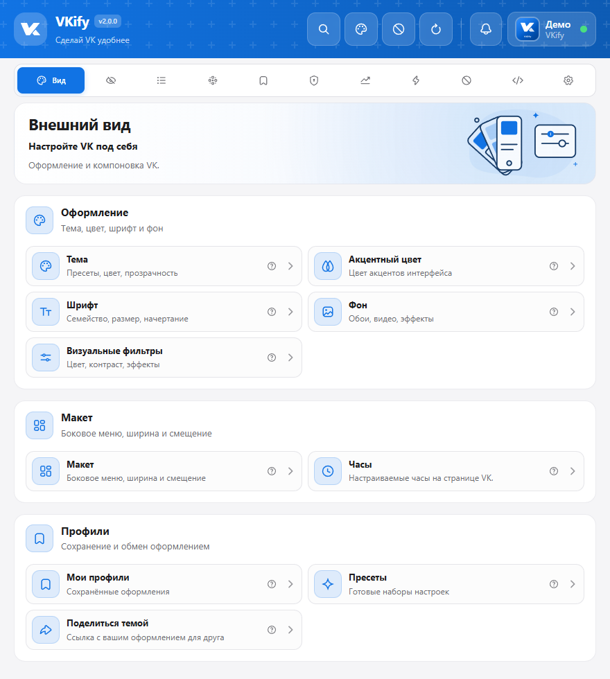

<div align="center">
  
  <h1>VKify</h1>

  Расширение для Chromium и Firefox: оформление, приватность и инструменты для ВКонтакте.

  [Сайт](https://vkify.ru) · [Chrome Web Store](https://chromewebstore.google.com/detail/vkify/lofggenkgbpdmmplnbgfplnpfjhgljla) · [Firefox Add-ons](https://addons.mozilla.org/ru/firefox/addon/vkify/) · [English](README.en.md)

  [](https://github.com/VKify/vkify-extension/actions/workflows/ci.yml)

  
</div>

## Возможности

- **Оформление:** темы, акцентные цвета, шрифты, настройка макета, фото-, видео- и веб-обои, включая HTML-проекты Wallpaper Engine. Профили оформления, ссылки на темы и редактор CSS.
- **Чистый интерфейс:** блокировка рекламы и трекеров, фильтр записей по словам и исключениям, отдельные настройки рекомендаций, скрытие блоков и пунктов меню. Статистика и журнал блокировок.
- **Приватность:** режим невидимки, отключение статусов прочтения и набора текста, скрытие диалогов, размытие при потере фокуса и шифрование сообщений (COFFEE и VKify E2E).
- **Медиа и музыка:** скачивание фото, альбомов, историй, видео и клипов; сохранение музыки в MP3. Мини-плеер, эквалайзер, горячие клавиши, автозапуск, визуализатор и синхронные тексты песен.
- **Центр:** экспорт аккаунта и диалогов, в том числе диалогов в PDF; статистика профиля и переписок, работа с вложениями, аудит и добавление друзей, обработка заявок, управление подписками и сбор участников сообществ. Массовые действия с проверкой списка, задержками и остановкой.
- **Виджеты:** часы, плеер, эквалайзер, визуализатор, тексты песен, центр загрузок и показатели производительности — с настройкой видимости и расположения.
- **Сообщения и уведомления:** шаблоны и заметки, отслеживание активности, онлайна и изменений профиля, уведомления браузера и через Telegram-бота.
- **Настройки:** русский и английский интерфейс, поиск функций, импорт и экспорт настроек, диагностика и показатели производительности.

Работает на `vk.ru` и `vkvideo.ru`. Настройки доступны по значку расширения и на странице `https://vk.ru/vkify_settings`. В окне настроек `Ctrl/Cmd + K` открывает поиск. Большинство изменений применяется сразу; после переключения API-фильтра рекламы может потребоваться обновить страницу.

## Установка

Установите расширение из [Chrome Web Store](https://chromewebstore.google.com/detail/vkify/lofggenkgbpdmmplnbgfplnpfjhgljla) или [Firefox Add-ons](https://addons.mozilla.org/ru/firefox/addon/vkify/). Архивы и история версий доступны в [GitHub Releases](https://github.com/VKify/vkify-extension/releases).

Минимальные версии по манифестам: Chromium 109 и Firefox 115.

### Из исходников

Для разработки используйте Node.js 22 и npm — эту версию Node.js использует CI.

```bash
git clone https://github.com/VKify/vkify-extension.git
cd vkify-extension
npm ci
npm run build
```

Сборка создаёт `dist/chrome` и `dist/firefox`.

- **Chromium:** откройте `chrome://extensions`, включите режим разработчика, нажмите «Загрузить распакованное» и выберите `dist/chrome`.
- **Firefox:** откройте `about:debugging#/runtime/this-firefox`, нажмите «Загрузить временное дополнение» и выберите `dist/firefox/manifest.json`. Для постоянной установки нужна подпись Mozilla.

После установки или перезагрузки расширения обновите открытые страницы VK.

## Разработка и проверки

UI написан на React и TypeScript; скрипты страницы и фоновые службы — на TypeScript. Сборка использует Vite, тесты — Vitest и Playwright.

| Команда | Назначение |
|---|---|
| `npm run dev` | Dev-сервер интерфейса настроек |
| `npm run build` | Проверка типов и сборка обоих браузеров |
| `npm run build:chrome` / `npm run build:firefox` | Сборка одного браузера без проверки типов |
| `npm run build:dev` | Chrome-сборка с localhost-мостом и логами |
| `npm run typecheck` | Проверка TypeScript |
| `npm run lint` | ESLint: ограничения и совместимость браузеров |
| `npm test` | Юнит- и компонентные тесты |
| `npm run verify:build` | Проверка структуры сборок и манифестов |
| `npm run check:size` | Проверка gzip-бюджетов бандлов |
| `npm run lint:firefox` | Проверка Firefox-сборки через web-ext |
| `npm run test:e2e` | E2E-тесты в Chromium; требуются обе сборки и Playwright Chromium |
| `npm run package:chrome` / `npm run package:firefox` | Сборка и упаковка ZIP в `dist/packages` |

CI запускает проверку типов, ESLint, тесты, сборки обоих браузеров, проверку структуры и размера, Firefox lint и Chromium E2E. Полная последовательность локально:

```bash
npm ci
npm run typecheck
npm run lint
npm test
npm run build
npm run verify:build
npm run check:size
npm run lint:firefox
npx playwright install chromium
npm run test:e2e
```

На Linux для установки системных зависимостей используйте `npx playwright install --with-deps chromium`, а E2E запускайте через `xvfb-run -a npm run test:e2e`, как в [CI](.github/workflows/ci.yml).

## Структура проекта

- `src/popup` — интерфейс настроек.
- `src/background` — API, загрузки и уведомления.
- `src/content` — функции на страницах VK, встроенные настройки и скрипты контекста страницы.
- `src/shared` — настройки, миграции и общий код.
- `manifest` и `scripts` — манифесты браузеров и сборка.
- `e2e` — браузерные тесты; тесты Vitest находятся в `src`.

Подробности: [архитектура](ARCHITECTURE.md), [различия браузеров](CROSS_BROWSER.md), [участие в разработке](CONTRIBUTING.md), [заметки релизов](.github/release-notes).

## Обратная связь и поддержка

[Сообщить об ошибке](https://github.com/VKify/vkify-extension/issues) · [Telegram](https://t.me/VKify) · [Сообщество VK](https://vk.ru/vkify)

Поддержать разработку: [Cloudtips](https://pay.cloudtips.ru/p/b59e1765) · [Tribute](https://t.me/tribute/app?startapp=dE4k).
